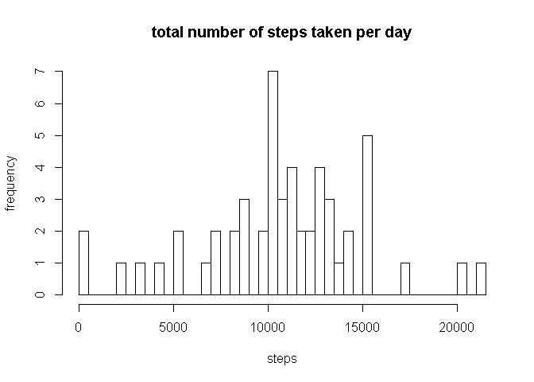
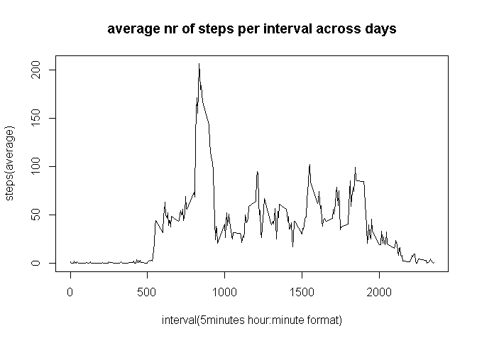
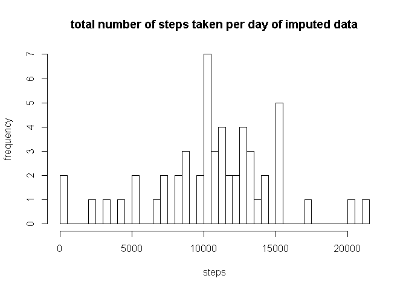
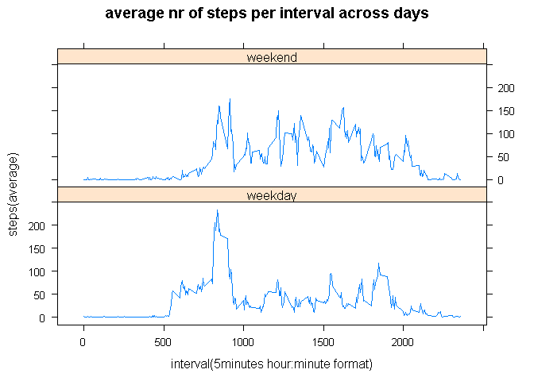

# Reproducible Research: Peer Assessment 1
A device collects data at 5 minute intervals through out the day. The data consists of two months of data from an anonymous individual collected during the months of October and November, 2012 and include the number of steps taken in 5 minute intervals each day.
There are 12 intervals per hour, the hour is prefixed to an interval, eg interval 15 is recorded at 0:15, interval 835 is recorded at 8:35


## Loading and preprocessing the data

```r
library(plyr)
library(lattice)
setwd("F:/dload/coursera/reproducible research/RepData_PeerAssessment1")


if( !file.exists("activity.csv") )
{  
  unzip("activity.zip")
}
data.raw <- read.csv("activity.csv",header=TRUE,sep=",")
file.remove("activity.csv")
```

```
## [1] TRUE
```

```r
# no additional prepocessing done, NAs retained, dates not coerced
```


## What is mean total number of steps taken per day?
Only complete cases are considered, ie records with values for all fields

```r
total <- ddply(data.raw[complete.cases(data.raw),], .(date), summarize,sum = sum(steps))
hist(total$sum,breaks=100,main="total number of steps taken per day",xlab="steps",ylab="frequency")
```

 

mean of total daily steps

```r
mean(total$sum)
```

```
## [1] 10766
```
median of total daily steps

```r
median(total$sum)
```

```
## [1] 10765
```


## What is the average daily activity pattern?

```r
avg <- ddply(data.raw, .(interval), summarize,avgsteps = mean(steps,na.rm=TRUE))
plot(avg,type="l", main="average nr of steps per interval across days", xlab="interval(5minutes hour:minute format)",ylab="steps(average)")
```

 

Maximum of average steps per interval at interval

```r
avg[which.max(avg$avgsteps),]$interval
```

```
## [1] 835
```
Subject seems to start the day early around 5:45, walking peaks around 8:35. Subject stays active during the day untill around 19:20 when average nr of steps is tapering of

## Imputing missing values
Total of missing steps values

```r
sum(is.na(data.raw$steps))
```

```
## [1] 2304
```
Imputing missing values by setting a missing value to the average of the same interval

```r
data.raw.imputed <- data.raw

data.raw.imputed[is.na(data.raw.imputed$steps),]$steps <- sapply(data.raw.imputed[is.na(data.raw.imputed$steps),]$interval, function(iv) avg[avg$interval==iv,]$avgsteps)
```

Check total difference unimputed data and imputed data is 0 for records with no missing value

```r
sum(data.raw.imputed[!is.na(data.raw$steps),]$steps != data.raw[!is.na(data.raw$steps),]$steps)
```

```
## [1] 0
```


```r
total.imputed <- ddply(data.raw, .(date), summarize,sum = sum(steps))
hist(total.imputed$sum,breaks=50,main="total number of steps taken per day of imputed data",xlab="steps",ylab="frequency")
```

 

mean of total daily steps for imputed data

```r
mean(total.imputed$sum,na.rm=TRUE)
```

```
## [1] 10766
```
median of total.imputed daily steps for imputed data

```r
median(total.imputed$sum,na.rm=TRUE)
```

```
## [1] 10765
```
'total nr steps' mean and median of original and imputed are the same

## Are there differences in activity patterns between weekdays and weekends?

```r
is_weekend  <- function(d) { if ( as.POSIXlt(d)$wday %in% c(0, 6) ) "weekend" else "weekday" }
data.raw$wp <- sapply(data.raw$date,is_weekend)

avg.week <- ddply(data.raw, .(interval,wp), summarize,avgsteps = mean(steps,na.rm=TRUE))

xyplot(avgsteps ~ interval | wp, data = avg.week, layout = c(1, 2), type="l", main="average nr of steps per interval across days", xlab="interval(5minutes hour:minute format)",ylab="steps(average)")
```

 
Subject appears to start the day of a little later in the weekend and has a higher overall activity pattern during the day. In the weekend there is more activity late evening.


